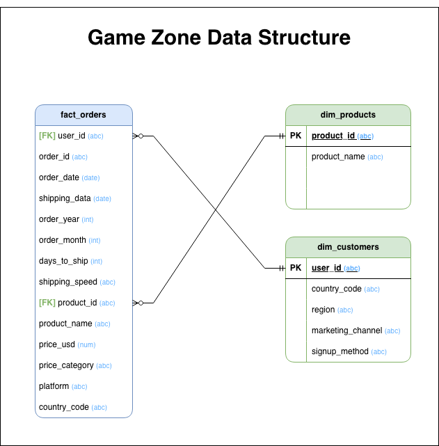

# Game-Zone-Analytics
---
## Background
GameZone is a consumer electronics retailer specializing in gaming consoles, computer hardware, and related accessories, selling its products across multiple geographic regions through a mix of marketing channels, including Direct, Email, Affiliate, and Social Media.

The objective of this analysis is to understand historical revenue performance, identify key drivers of growth and decline, and assess how products, regions, and marketing channels contributed to overall business outcomes. This goal is to provide insights that may boost and/or stabilize revenue and improve product performance.

Insights and recommendations are provided in the following key areas:

-  **Time-Series & Trend Analysis:** Analysis of revenue trends over time to identify seasonality, growth inflection points, and structural changes in demand. This analysis will focus on Total Revenue (Monthly), Seasonal index/holiday uplift %, and Revenue Volatility.

-  **Product Performance & Revenue Concentration Analysis:** An evaluation of revenue contribution by product to identify top-performing SKUs and revenue concentration risk. We will focus on Revenue by Product, % of Total Revenue by Product, Top 5 Product Revenue Share, and Revenue Concentration Ratio.

-  **Regional Performance Analysis:** Assessing revenue trends by region to determine key growth markets, focusing on Revenue by Region, Region Contribution % to Total Revenue, Regional Revenue Volatility, and Region-Specific Seasonal Uplift %.

-  **Marketing Channel Effectiveness Analysis:** An analysis of revenue performance by marketing channel to understand customer acquisition and conversion behavior. This analysis will focus on Revenue by Marketing Channel, Channel Contribution % to Total Revenue, Channel Mix Share (%), and Revenue per Channel per Period.

-  **Multi-Dimensional Driver & Decline Analysis:** Here, we will conduct a deep-dive analysis across product, region, and channel combinations to identify specific drivers of revenue changes. This analysis will focus on Revenue by Product–Region–Channel Combination, Contribution to Total Revenue Change (%), Top Positive / Negative Revenue Drivers, and Revenue Dependency Index.

An interactive Tableau dashboard can be downloaded [here](Tableau/dashboard/game_zone_dashboard.twbx).

The SQL queries utilized to inspect and perform quality checks can be found [here](SQL/quality_checks).

The SQL queries utilized to clean, organize, and prepare the data for the dashboard can be found [here](SQL/ddl).

---
## Data Structure Overview

---
## Executive Summary

Revenue performance shows a clear structural shift beginning in January 2020, with sustained growth through December 2020 and pronounced seasonal spikes in September and December across multiple years. 

A small set of products—particularly Monitor, Switch, PS5, and IdeaPad—drive a disproportionate share of total revenue, with North America and EMEA contributing the majority of regional performance and Direct marketing dominating channel mix. While pandemic-driven demand accelerated growth across all dimensions, revenue remains highly concentrated, with individual product–region–channel combinations materially impacting overall performance. 

The post–December 2020 decline highlights both seasonal normalization and concentration risk, underscoring the importance of diversification and targeted performance monitoring.
