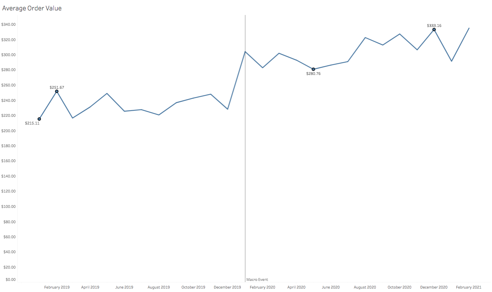
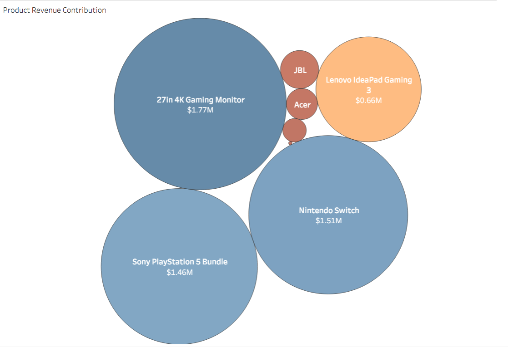
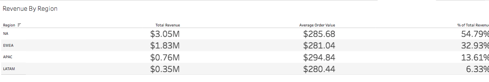
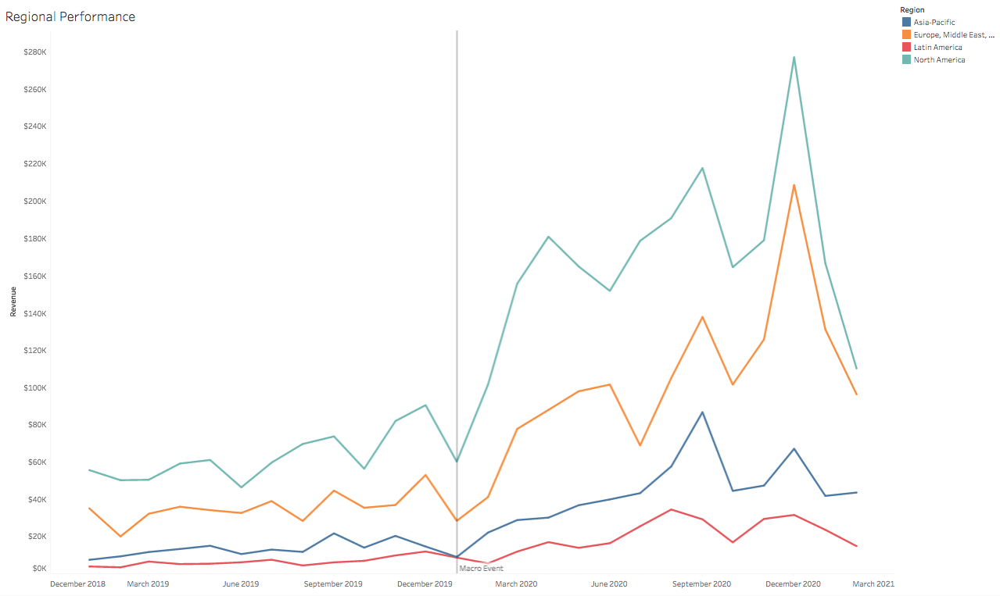
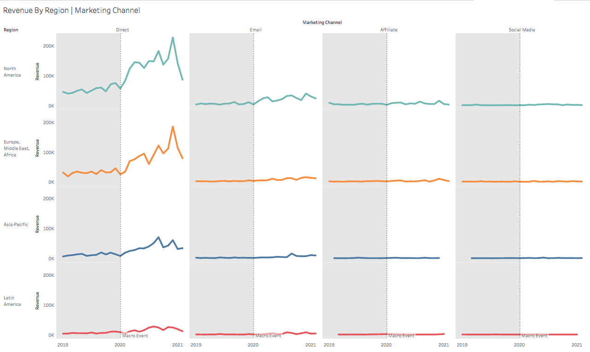

# Game-Zone-Analytics
---
## Background
GameZone is a consumer electronics retailer specializing in gaming consoles, computer hardware, and related accessories, selling its products across multiple geographic regions through a mix of marketing channels.

The objective of this analysis is to understand historical revenue performance, identify key drivers of growth and decline, and assess how products, regions, and marketing channels contributed to overall business outcomes. This goal is to provide insights that may boost and/or stabilize revenue and improve product performance.

Insights and recommendations are provided in the following key areas:

-  Time-Series & Trend Analysis

-  Product Performance & Revenue Concentration Analysis

-  Regional Performance Analysis

-  Marketing Channel Effectiveness Analysis

-  Multi-Dimensional Driver & Decline Analysis

An interactive Tableau dashboard can be downloaded [here](Tableau/dashboard/game_zone_dashboard.twbx).

The SQL queries utilized to inspect and perform quality checks can be found [here](SQL/quality_checks).

The SQL queries utilized to clean, organize, and prepare the data for the dashboard can be found [here](SQL/ddl).

---
## Data Structure Overview

GameZone sales data consists of a single Excel file (.xlsx) containing 21,865 records. The original file can be found [here](Excel/dataset/gamezone-orders-data.xlsx).

After initial data cleaning steps were implemented in Excel, SQL was used to perform final cleaning and preparation for dashboard creation. The SQL queries used to create the data structure and prepare it for the dashboard can be found [here](SQL/ddl).

Below is an Entity Relationship Diagram showing the database structure used for this analysis. The database consists of three tables: fact_orders, dim_customers, and dim_products, with a total of 19,761 records.

---
## Executive Summary

### Overview of Findings

Revenue performance shows a clear structural shift beginning in January 2020, with sustained growth through December 2020 and pronounced seasonal spikes in September and December across multiple years. 

A small set of products—particularly Monitor, Switch, PS5, and IdeaPad—drive a disproportionate share of total revenue, with North America and EMEA contributing the majority of regional performance and Direct marketing dominating channel mix. While pandemic-driven demand accelerated growth across all dimensions, revenue remains highly concentrated, with individual product–region–channel combinations materially impacting overall performance. 

The post–December 2020 decline highlights both seasonal normalization and concentration risk, underscoring the importance of diversification and targeted performance monitoring.

Below is a snapshot of the Tableau dashboard highlighting these patterns, with additional examples included throughout this report. The full interactive Tableau dashboard can be downloaded [here](Tableau/dashboard/game_zone_dashboard.twbx).

### Time-Series & Trends

- Monthly revenue exhibits recurring spikes in September and December across both 2019 and 2020, reaching highs of $166K in December 2019 and $496K in December 2020. These patterns are consistent with back-to-school and holiday promotional periods.
- A sharp and sustained increase in activity begins in January 2020, continuing through a peak in December 2020, indicating a structural shift rather than normal seasonality.
- The January 2020 inflection point is observed across nearly all products and regions, suggesting a company-wide macro event as the primary driver of growth. YoY revenue grew ~160% during this period.
- Revenue volatility increases following January 2020, reflecting amplified demand fluctuations during peak promotional and holiday periods.

The chart below shows monthly revenue throughout the dataset, highlighting the outsized effect of the January 2020  macro event.

### Product Performance & Revenue Concentration

- Prior to the January 2020 event, Average Order Value (AOV) remained relatively steady with a low in January 2019 of $215.11, and a high in February 2019 of $251.67. Going into 2020, however, AOV increased sharply starting in December 2019, and increased steadily afterwards with a 2020 low of $280.76 and a high of $333.16

- Revenue is highly concentrated among four products: Monitor, Switch, PS5, and IdeaPad, which together account for ~96% of total revenue.

- The January 2020 demand surge exaggerates product-level concentration. Revenue share of the four highest-selling products rose from 96.3% of total revenue to 97.1%.
- This concentration elevates revenue dependency risk, as a limited number of products heavily influences overall performance.
- The 2020 Macro Event saw the PlayStation's contribution to total revenue increase from 16.16% in 2019 to 29.87% in 2020. Because more people were staying home during this time, they likely had more time and desire to purchase more PlayStations.
- Conversely, the Nintendo Switch saw its revenue contribution decrease from 33.08% in 2019 to 24.78% in 2020, likely also owing to the influence of the Macro Event. If more people were staying home, they likely had less desire to purchase a portable gaming system.

Below is a revenue concentration graph highlighting the impact that the four highest-selling products have on total revenue.

### Regional Performance

- North America and EMEA are the primary contributors to total revenue, with North America contributing 54.79% of total revenue and EMEA contributing 32.93%.

- All regions display a synchronised spike in activity beginning in January 2020, reinforcing the presence of a macro-level, company-wide demand shift.
- Seasonal spikes in September and December are visible across regions, with the largest impact observed in North America and EMEA.

Below is a chart highlighting the impact of the Jan 2020 macro event, and its impact on revenue split by region

### Marketing Channel Effectiveness

- The Direct marketing channel dominates revenue contribution compared to all other channels, making up 86% of all traffic across all regions, while bringing in $4.81M in total revenue
- Following the January 2020 Macro Event, Direct revenue grew at a substantially faster rate than other channels. This pattern was observed across all regions, but was significantly more pronounced in North America and EMEA.
- The increased share of Direct traffic suggests a rise in high-intent customer behavior, potentially influenced by lockdown-related changes.

